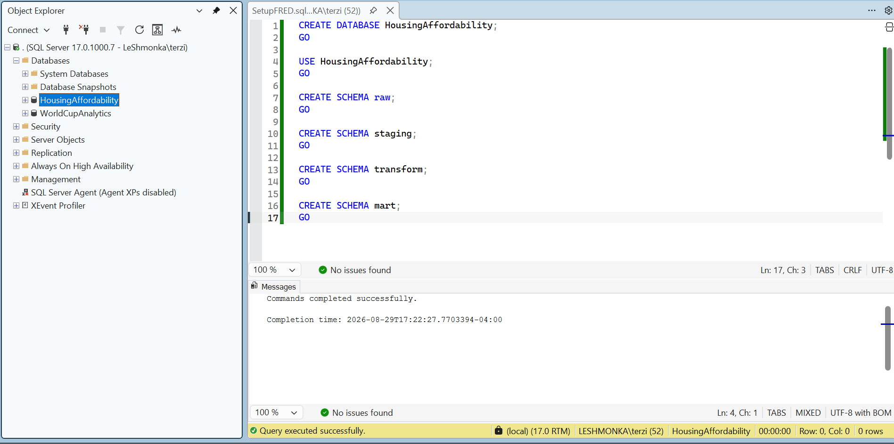
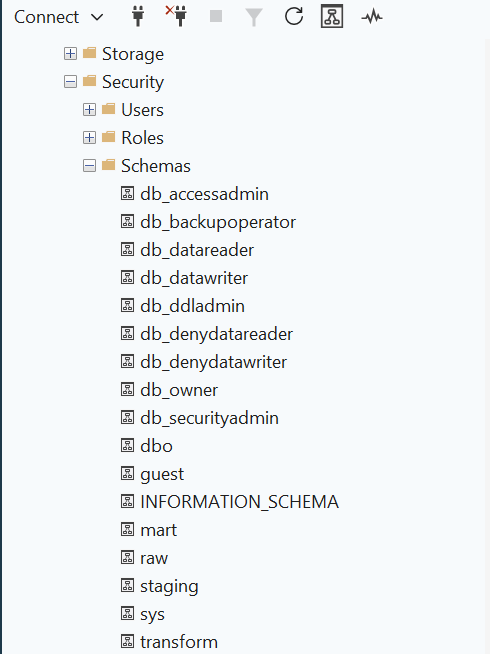

# Housing Affordability Analytics

A hands-on analytics engineering tutorial that builds a complete workflow from a public API to SQL Server and ultimately to exploratory data analysis in Python.

The project is centered on one business question:

> **How affordable is the U.S. housing market when considering home prices, mortgage rates, housing supply, and household purchasing power?**

Rather than beginning with charts or a pre-cleaned dataset, this project starts at the source and follows the data through ingestion, transformation, modeling, validation, and analysis.

---

## Why This Project?

Analytics starts with a question.

The tools and architecture may change from project to project, but the underlying workflow is generally consistent:

```text
Business Problem
      ↓
Required Data
      ↓
Data Ingestion
      ↓
Cleaning & Standardization
      ↓
Transformation & Business Logic
      ↓
Business-Ready Data
      ↓
Analysis
      ↓
Decision Support
```

This repository documents that workflow from beginning to end using real public housing and economic data.

The goal is not only to produce an EDA. It is to understand how data moves from an external source into a trusted analytical dataset and why each layer of that process exists.

---

# Business Problem

Housing affordability cannot be understood from home prices alone.

A home may become more expensive because prices increase, but affordability can also deteriorate when mortgage rates rise, housing supply becomes constrained, or household income fails to keep pace with housing costs.

This project will investigate affordability through four primary components:

### Home Prices

How have U.S. home prices changed over time?

### Mortgage Rates

How has the cost of borrowing changed, and how might higher or lower rates affect the cost of purchasing a home?

### Housing Supply

How has housing availability changed over time, and what relationship might supply conditions have with prices?

### Household Purchasing Power

How have household incomes changed relative to housing costs?

Together, these measures provide a more complete view of housing affordability than any individual metric.

---

# Analytical Question

The primary V1 question is:

> **How affordable is the U.S. housing market based on home prices, mortgage rates, housing supply, and household purchasing power?**

Supporting questions will emerge during the analysis, including:

- How have home prices changed over time?
- How have mortgage rates changed the cost of financing a home?
- How has housing supply changed?
- Has household purchasing power kept pace with housing costs?
- During which periods did affordability conditions improve or deteriorate?
- Do changes in supply, rates, and prices appear to move together?
- Which factors appear most closely associated with major affordability shifts?

These questions will guide both the data model and the eventual EDA.

---

# Data Source

The initial source for the project is the **Federal Reserve Economic Data (FRED) API**, maintained by the Federal Reserve Bank of St. Louis.

FRED provides historical economic time-series data covering housing, interest rates, income, employment, inflation, and many other economic indicators.

For this project, the API will provide selected series representing the four components of the affordability framework:

```text
FRED
│
├── Home Price Data
├── Mortgage Rate Data
├── Housing Supply Data
└── Household Income / Purchasing Power Data
```

The exact FRED series will be selected and documented before ingestion begins.

---

# Project Architecture

The V1 architecture intentionally uses a straightforward local analytics stack so the complete data lifecycle can be understood.

```text
                     FRED REST API
                           │
                           ▼
                    Python Ingestion
                           │
                           ▼
                       SQL Server
                           │
              ┌────────────┼────────────┐
              │            │            │
              ▼            ▼            ▼
             RAW       STAGING      TRANSFORM
                                         │
                                         ▼
                                        MART
                                         │
                                         ▼
                              Python / pandas
                                         │
                                         ▼
                                       EDA
                                         │
                                         ▼
                                Business Findings
```

### Technology Stack

| Component | Technology |
| --- | --- |
| Data Source | FRED REST API |
| Ingestion | Python |
| Database | Microsoft SQL Server |
| Data Transformation | SQL |
| Analytical Modeling | SQL Server |
| Exploratory Analysis | Python / pandas |
| Development Environment | VS Code / Jupyter |
| Visualization | Matplotlib |
| Version Control | Git / GitHub |

The architecture may expand in future versions, but V1 intentionally focuses on understanding the core analytical workflow before introducing additional infrastructure.

---

# Tutorial Structure

The project is organized into three major tutorials.

## Part 1 — API to SQL Server

The first section focuses on getting external data reliably into the analytical environment.

Topics will include:

- Understanding the FRED API
- Selecting economic series
- Managing API credentials
- Making REST API requests with Python
- Inspecting JSON responses
- Connecting Python to SQL Server
- Designing the raw landing layer
- Loading API observations
- Adding ingestion metadata
- Validating the load

**Goal:** reliably move source data from FRED into SQL Server while preserving source fidelity.

---

## Part 2 — Raw to Business-Ready Data

Once the source data has been ingested, the second section will focus on transforming it into reliable analytical data.

The SQL Server pipeline will follow four logical layers:

```text
RAW
 │
 ▼
STAGING
 │
 ▼
TRANSFORM
 │
 ▼
MART
```

### Raw

Preserves source data as close to its original representation as practical.

### Staging

Standardizes names, data types, dates, missing values, and other source-specific formatting.

### Transform

Applies reusable analytical logic such as period alignment, growth calculations, rolling measures, and affordability-related metrics.

### Mart

Publishes stable business-ready data designed for downstream analysis.

**Goal:** create a trusted analytical dataset so downstream users do not need to repeatedly clean and reconstruct source data.

---

## Part 3 — Housing Affordability EDA

The final section will connect Python directly to the validated SQL Server mart.

The notebook will investigate the original business question through:

- Data validation
- Descriptive analysis
- Time-series trends
- Year-over-year and period-over-period changes
- Relationships between affordability factors
- Investigation of unusual periods
- Visualizations
- Business interpretation
- Limitations
- Future analytical questions

The notebook will consume business-ready data rather than repeat transformations that belong in the SQL pipeline.

**Goal:** turn trusted analytical data into evidence that helps answer the housing affordability question.

---

# Data Quality Philosophy

Data validation will occur throughout the pipeline rather than only before analysis.

Each layer answers a different quality question:

| Layer | Validation Question |
| --- | --- |
| Raw | Did we ingest what the source returned? |
| Staging | Is the source data structurally reliable and consistently typed? |
| Transform | Did our analytical logic behave as intended? |
| Mart | Is the final dataset trustworthy at its declared grain? |

Examples include row-count reconciliation, null checks, duplicate investigation, data-type validation, grain validation, join-cardinality checks, and validation of calculated metrics.

A successful SQL query does not automatically mean the resulting data is correct.

---

# Repository Structure

```text
housing-affordability-analytics/
│
├── README.md
├── requirements.txt
│
├── ingestion/
│   └── README.md
│
├── sql/
│   ├── 01_raw/
│   ├── 02_staging/
│   ├── 03_transform/
│   └── 04_marts/
│
├── notebooks/
│   └── README.md
│
├── docs/
│   ├── architecture.md
│   ├── data_dictionary.md
│   ├── data_quality.md
│   └── findings.md
│
└── tests/
    └── README.md
```

The repository will grow alongside the tutorial. Code, validation queries, screenshots, and documentation will be added as each stage is completed.

---

# Current Status

### Phase 0 — Project Definition ✅

Completed:

- Defined the business problem
- Defined the primary analytical question
- Established the affordability framework
- Selected FRED as the initial public data source
- Defined the high-level architecture
- Defined the Raw → Staging → Transform → Mart workflow
- Established the repository and documentation structure
- Defined the initial data-quality philosophy

## Part 1 — FRED API → SQL Server

### Step 1 — Set Up the SQL Server Environment ✅

Before retrieving data from the FRED API, the SQL Server environment was created first. This establishes where the source data will land and separates the major responsibilities of the analytical pipeline before ingestion begins.

A dedicated database called `HousingAffordability` was created for the project. Four schemas were then created inside the database:

```sql
CREATE DATABASE HousingAffordability;
GO

USE HousingAffordability;
GO

CREATE SCHEMA raw;
GO

CREATE SCHEMA staging;
GO

CREATE SCHEMA transform;
GO

CREATE SCHEMA mart;
GO
```



#### What is happening here?

`CREATE DATABASE HousingAffordability` creates the main SQL Server database that will contain the project's data objects.

`USE HousingAffordability` changes the active database context so the objects created afterward belong to the housing affordability project rather than another database on the SQL Server instance.

The four `CREATE SCHEMA` statements create logical namespaces inside the database. Instead of placing every table under the default `dbo` schema, tables can be organized according to their role in the pipeline.

The intended flow is:

```text
raw
 ↓
staging
 ↓
transform
 ↓
mart
```

- **raw** — landing area for data received from FRED with minimal modification. The priority is source fidelity and traceability.
- **staging** — standardizes source data, including names, data types, dates, null handling, and other structural cleanup.
- **transform** — contains reusable analytical and business logic such as time alignment, growth calculations, ratios, and other derived measures.
- **mart** — publishes stable business-ready data that downstream tools such as Python notebooks or Power BI can consume without repeating source-specific cleaning.

The schemas were then verified in SQL Server Object Explorer:



This confirms that the database now has the logical structure needed for the source-to-analysis workflow.

#### Why separate the layers with schemas?

The schemas do not physically create the pipeline by themselves. They provide organization and separation of responsibility inside one database.

For example, as the project develops, objects may follow a naming pattern such as:

```text
raw.fred_observations
staging.fred_observations
transform.housing_metrics
mart.housing_affordability
```

This makes it clear where an object belongs in the data lifecycle and prevents ingestion, cleaning, business logic, and analytical outputs from being mixed together.

It also improves traceability. If a value in the final mart appears incorrect, the pipeline can be followed backward through transform, staging, and raw to determine whether the issue originated in the source data or in downstream logic.

> **Key takeaway:** establish the analytical environment and layer responsibilities before ingestion so incoming data has a clearly defined destination and transformation path.

### Step 2 — Get a FRED API Key ✅

FRED exposes economic data through a REST API. To make authenticated requests, each user should create their own API key.

#### How to get a FRED API key

1. Create or sign in to a free FRED account.
2. Open the FRED API key section from the account settings.
3. Request or generate an API key.
4. Store the key locally and do **not** commit it to GitHub.

For this project, the key will be stored in a local `.env` file:

```text
FRED_API_KEY=your_api_key_here
```

The repository `.gitignore` excludes `.env` files so secrets are not accidentally committed.

> **Security principle:** credentials belong in environment variables or another secret-management mechanism, not directly inside source code.

### Selected V1 FRED Series

The first ingestion will focus on four national housing and affordability indicators:

| Business Concept | FRED Series | Frequency |
| --- | --- | --- |
| Home Prices | `MSPUS` | Quarterly |
| Mortgage Rates | `MORTGAGE30US` | Weekly |
| Housing Supply | `MSACSR` | Monthly |

Household income can be added later once the initial API-to-SQL Server pipeline is working.

The different source frequencies are intentional. They will create a realistic transformation problem later when the data must be aligned to a common analytical grain.

### Next Implementation Step

The next step is to build a small Python ingestion script in VS Code.

The script will:

```text
Load API key from .env
        ↓
Call the FRED REST API
        ↓
Receive JSON observations
        ↓
Inspect and lightly shape the source data
        ↓
Connect to SQL Server
        ↓
Insert records into the raw schema
```

Python is being used for ingestion because it handles REST requests and JSON responses cleanly and can connect directly to SQL Server using libraries such as `pyodbc` or SQLAlchemy.

SQL Server will then take over for the downstream analytics engineering workflow:

```text
raw
 ↓
staging
 ↓
transform
 ↓
mart
```

The first Python test will retrieve a single FRED series and print several observations before any data is inserted into SQL Server. This allows the source response and expected grain to be understood before the raw table is designed.

No FRED data has been loaded into SQL Server yet.
